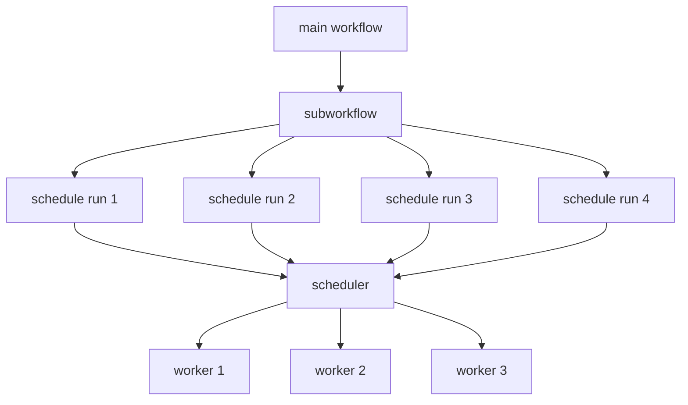

# Using existing workflows

------------------------------------------------------------

## Exploring available workflows

All registered workflows can be printed at the command-line.
``` bash
simmate workflows list-all
```

You can also learn more about a workflow with the `explore` command:
``` bash
simmate workflows explore
```

!!! tip
    Read through the ["Workflow Names"](/full_guides/workflows/workflow_names/)
    section for a better understanding of the different workflows available.    

------------------------------------------------------------

## Loading a workflow

Once you have a desired workflow name, you can load the workflow with:

=== "yaml"
    ``` yaml
    # in example.yaml
    workflow_name: static-energy.vasp.matproj
    ```

=== "python"
    ``` python
    from simmate.workflows.utilities import get_workflow
    
    workflow = get_workflow("static-energy.vasp.matproj")
    ```

------------------------------------------------------------

## Viewing parameters & options

Because parameters are super important for using Simmate, we gave them [their own
section in our documentation](/parameters). Make sure you read through that section of our
documentation to view full parameter descriptions and examples for each.

------------------------------------------------------------

## Running a workflow (local)

To run a workflow locally (i.e. directly on your current computer), you can
use the `run` method. As a quick example:

=== "command line"
    ``` yaml
    # in example.yaml
    workflow_name: static-energy.vasp.matproj
    structure: NaCl.cif
    command: mpirun -n 4 vasp_std > vasp.out
    ```
    ``` bash
    simmate workflows run example.yaml
    ```

=== "python"
    ``` python
    from simmate.workflows.utilities import get_workflow
    
    workflow = get_workflow("static-energy.vasp.matproj")
    
    state = workflow.run(
        structure="NaCl.cif", 
        command="mpirun -n 4 vasp_std > vasp.out",
    )
    ```

------------------------------------------------------------

## Running a workflow (cloud)

Workflows can also be submitted to a remote cluster. It is important to understand
how local and cloud runs are different:

=== "local (run)"
    ``` mermaid
    graph TD
      A[submit with 'run' command] --> B[starts directly on your local computer & right away];
    ```

=== "remote submission (run-cloud)"
    ``` mermaid
    graph TD
      A[submit with 'run-cloud' command] --> B[adds job to scheduler queue];
      B --> C[waits for a worker to pick up job];
      C --> D[worker selects job from queue];
      D --> E[runs the job where the worker is];
      F[launch a worker with 'start-worker' command] --> D;
    ```

Therefore, when you want to schedule a workflow to run elsewhere, you must first make sure
you have your computational resources configured. You can then run workflows
using the `run_cloud` method:


=== "command line"
    ``` yaml
    # in example.yaml
    workflow_name: static-energy.vasp.matproj
    structure: NaCl.cif
    command: mpirun -n 4 vasp_std > vasp.out
    ```
    ``` bash
    simmate workflows run-cloud example.yaml
    ```

=== "python"
    ``` python
    from simmate.workflows.utilities import get_workflow
    
    workflow = get_workflow("static-energy.vasp.matproj")
    
    state = workflow.run_cloud(
        structure="NaCl.cif", 
        command="mpirun -n 4 vasp_std > vasp.out",
    )
    ```

!!! warning
    The `run-cloud` command/method only **schedules** the workflow. It won't 
    run until you add computational resources (or `Workers`). To do this, you
    must read through the ["Computational Resources"](/getting_started/add_computational_resources/quick_start/) documentation.

------------------------------------------------------------

## Accessing results

There are several ways to view the results of a workflow run, and some approaches
are better than others.

!!! tip
    If you'd like to run many workflows and get the results in an excel
    spreedsheet, then go with option 3!


### Option 1: output files

Simply go to the directory that the calculation ran in, and you may notice a 
few extra files in your output. One of them is `simmate_summary.yaml`, which 
contains some quick information for you.

Simmate can also catch errors, correct them, and retry a calculation. If this 
occurred during your workflow run, you'll see a file named 
`simmate_corrections.csv` with all the errors that were incountered and how they
were fixed.

Other workflows will also write out plots for you. For example, 
`electronic-structure` workflows will calculate a band structure using Materials
Project settings, and write an image of your final band structure to 
`band_structure.png`. These extra files and plots vary for each workflow, 
but they make checking your results nice and quick.

!!! tip
    While the plots and summary files are nice for quick viewing, there is much 
    more information available in the database. Furthermore, you can also use
    python toolkit objects to run a custom analysis. These are covered in the 
    next two sections.


### Option 2: python objects

When running a workflow in python, a `State` object is returned. From this,
you can access the results as `toolkit` objects. States allows you to
check if the run completed successfully or not. Then final output of your
workflow run can be accessed using `state.result()`. The `State` is based off
of Prefect's state object, which you can read more about 
[here](https://orion-docs.prefect.io/concepts/states/). We use `State`s because 
the status of a run becomes important when we start scheduling runs to run
remotely, and more importantly, it allows use to building in compatibility with
other workflow engines like Prefect.

=== "python (local)"
    ``` python
    state = workflow.run(...)
        
    result = state.result()
    ```

=== "python (cloud)"
    ``` python
    state = workflow.run_cloud(...)
    
    # This will block and wait for the job to finish
    result = state.result()
    ```


!!! tip
    This approach is best for users comfortable with python. If you want to use these
    features, we recommend reading through the `Toolkit` guides.


### Option 3: the database

You can also view results database through the `database_table` attribute 
(if one is available). This returns a Simmate database object for results of 
ALL runs of this workflow. But as an example:

=== "python"
    ``` python
    table = workflow.database_table
    
    # pandas dataframe that you can view in Spyder
    df = table.objects.to_dataframe()
    
    # or grab a specific run result and convert to a toolkit object
    entry = table.objects.get(run_id="example-123456")
    structure = entry.to_toolkit()
    ```

You'll notice the table gives results for all runs of this type (e.g. all
static-energies). To limit your results to just this specific workflow, you
can use the `all_results` property:

=== "python"
    ``` python
    results = workflow.all_results 
    
    # the line above is a shortcut for...
    table = workflow.database_table
    results = table.objects.filter(workflow_name=workflow.name_full)
    ```

!!! tip
    Guides for filtering and manulipating the data in this table is covered 
    in the `Database` guides.


### Option 4: the website server

In the `simmate_summary.yaml` output file, there is the `_WEBSITE_URL_`. You can copy/paste this URL into your browser and view your results in an interactive format. Just make sure you are running your local server first:

``` shell
simmate run-server
```

Then open the link given by `_WEBSITE_URL_`:

```
http://127.0.0.1:8000/workflows/static-energy/vasp/mit/1
```

!!! note
    Remember that the server and your database are limited to your local computer. Trying to access a URL on a computer that doesn't share the same database file will not work -- so you may need to copy your database file from the cluster to your local computer. Or even better -- if you would like to access results through the internet, then you have to switch to a cloud database.

----------------------------------------------------------------------

## Massively parallel workflows

Some workflows submit many subworkflows. For example, evolutionary structure prediction does this by submitting hundreds of individual structure relaxations, analyzing the results, and submitting new structures based on the results.

This is achieved by the workflow manually calling `run-cloud` on others ([see section above on how run-cloud works](http://127.0.0.1:8000/full_guides/workflows/using_existing_workflows/#running-a-workflow-cloud)). If you start multiple workers elsewhere, you can calculate these subworkflows in parallel:




So in order to run these types of workflows, you must...

1. Start the main workflow with the `run` command
2. Start at least one worker that will run the submitted the calculations

!!! tip
    Make sure you read through the ["Computational Resources"](/getting_started/add_computational_resources/quick_start/) documentation. There is also a 
    [full walk-through example](/getting_started/evolutionary_search/quick_start/)
    of a massively-parallel workflow in the getting started
    guides.
    
!!! note
    The number of workers will be how many jobs are run in parallel -- and this
    is only limited by the number of jobs queued. For example, if I submit 500
    workflows with `run-cloud` but only start 100 workers, then only 100 workflows
    will be run at a time. Further, if I submit 25 workflows but have 100 workers,
    then that means 75 of our workflows will be sitting idle without any job
    to run.

----------------------------------------------------------------------    